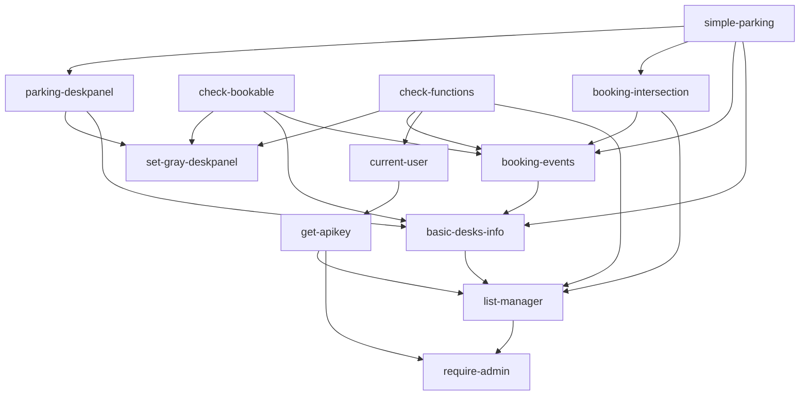
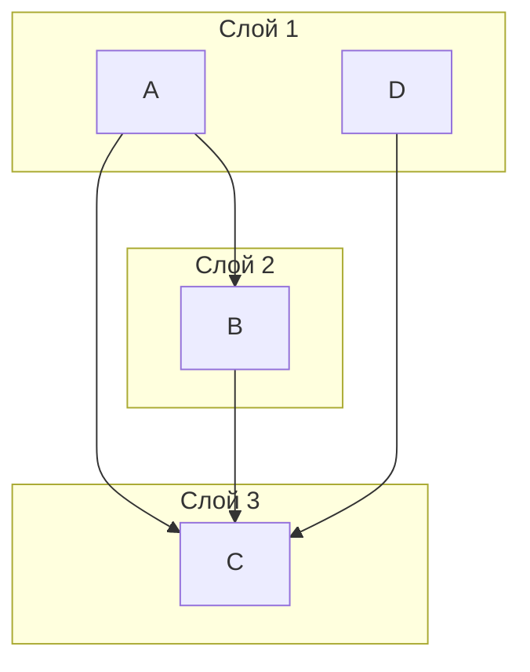

## Проблема

Карта компонентов получается запутанной и непонятной

## Задачи
1. Расположить компоненты по слоям, таким образом, что компоненты с меньшим числом зависимостей должны быть на более низких слоях чем компоненты с большим числом зависимостей. Соответсвенно компоненты от которых зависит меньшее число компонентов должны быть выше
2. Алгоритм минимального пересечения стрелок
3. Постараться учесть возможные циклические зависимости

<!-- - require-admin
- list-manager
- get-apikey
- current-user
- basic-desks-info
- set-gray-deskpanel
- parking-deskpanel
- booking-events
- check-bookable
- check-functions
- booking-intersection
- simple-parking-->